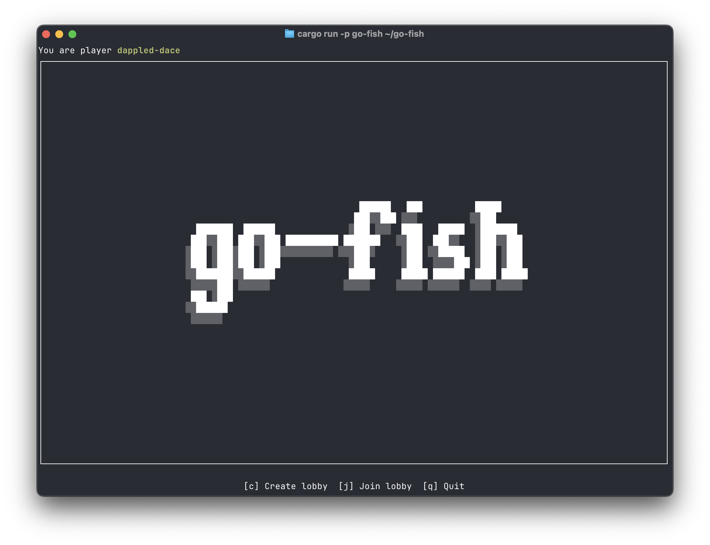
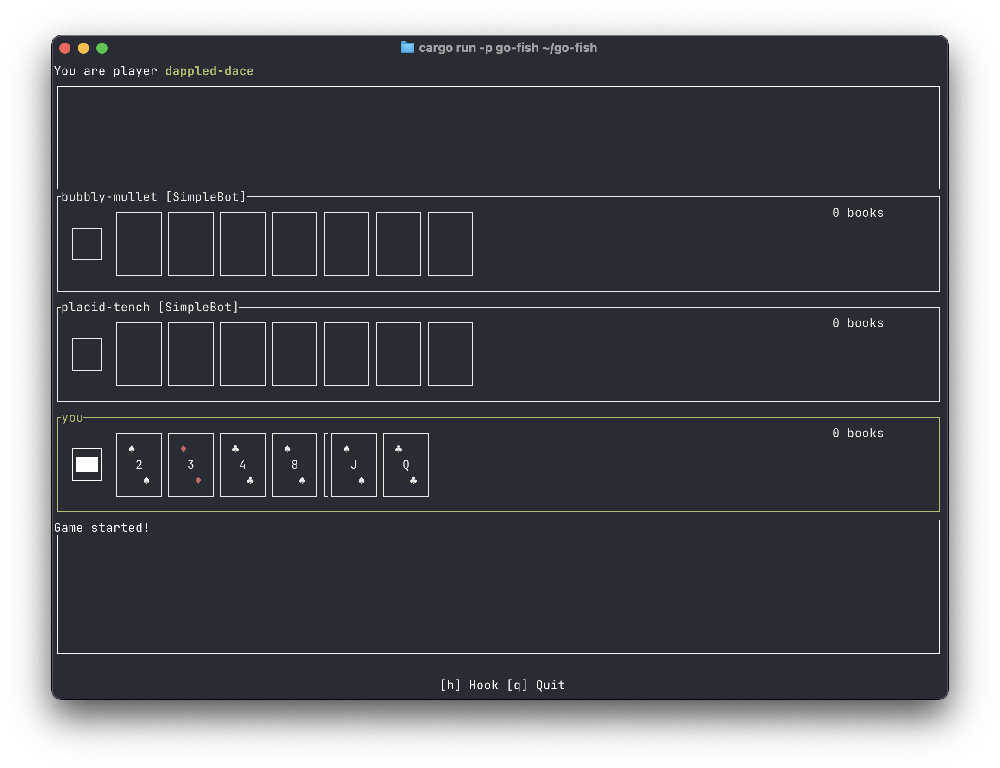

# go-fish

A multiplayer Go Fish card game implemented in Rust. Play in the terminal or [in your browser](https://terminaltom.com/go-fish).



## Features

- Multiplayer over WebSocket — create or join lobbies and play with others in real time
- Terminal UI client built with [ratatui](https://github.com/ratatui-org/ratatui), also compilable to WebAssembly
- Bot players — lobby leaders can fill empty slots with AI bots before starting
- Lobby browser — see and join open games without knowing a lobby ID

## Workspace

| Crate | Description |
|-------|-------------|
| [`go-fish`](go-fish/README.md) | Core game engine — pure library, no I/O |
| [`go-fish-web`](go-fish-web/README.md) | Shared WebSocket protocol types |
| [`go-fish-game-server`](go-fish-game-server/README.md) | Async Tokio WebSocket server with lobby management |
| [`go-fish-tui-client`](go-fish-tui-client/README.md) | Terminal (and WASM) client |

## Quick start



**Run the server:**

```bash
cargo run --package go-fish-game-server
# Listens on 127.0.0.1:9001 by default
```

**Connect with the TUI client:**

```bash
cargo run --package go-fish-tui-client
# Connects to wss://terminaltom.com/go-fish/game-server by default

# To connect to a local server, create a config.toml:
# server_url = "ws://127.0.0.1:9001"
cargo run --package go-fish-tui-client -- --config config.toml
```

**Run in the browser (WASM):**

```bash
cd go-fish-tui-client
trunk serve
# Opens at http://localhost:8080, proxies WebSocket traffic to ws://127.0.0.1:9001
```

Or just visit [terminaltom.com/go-fish](https://terminaltom.com/go-fish) to play without building anything.

## License

MIT
